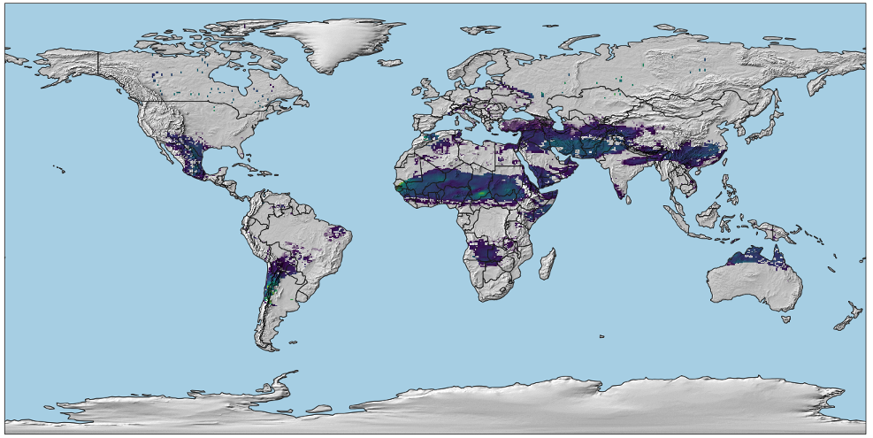

# Summary
`kuara` is a Python package that computes the global solar (photovoltaic (PV) and concentrated solar power (CSP)) and wind onshore technical potential at 0.5 geographic degree based on well-established methods described in the literature [@eurek2017improved; @gernaat2021climate; @karnauskas2018southward; @koberle2015assessing; @rinne2018effects]. `kuara` is the first open-source package for the purpose of estimation of renewable potentials with the advantage of allowing computations under distinct methodological assumptions. This enables researchers to assess the inherent uncertainty behind these estimates. The package accounts for a prebuilt methodology based on a literature survey. Specifically, the methods encompass the equations to compute the geographical and technical potentials and key assumptions pertaining to these equations, such as parameter values and choices of turbine technology in the case of wind power. Nevertheless, users have the flexibility to modify these assumptions as well as to replace or add individual components given the modular nature of the package.

{ width=75% }

# Statement of Need
Estimates of solar (PV and CSP) and wind onshore energy potentials are needed to support long-term energy-sector planning. Moreover, they are used to produce fundamental inputs (i.e., resource cost-supply curves) to integrated assessment models (IAMs), which are key analytical tools that project the potential future evolution of the power sector globally, including wind and solar power. Although various past studies [@bosch2018temporally; @eurek2017improved; @gernaat2021climate; @hoogwijk2004assessment; @koberle2015assessing; @zhou2012evaluation] have computed intermittent renewable energy potentials, the codes employed are not available to the scientific community making reproducibility difficult. Furthermore, estimates of renewable energy potentials are characterized by large uncertainties stemming from methodological factors (e.g., assumptions on key parameters in the equations), but past studies have typically relied on a fixed pool of assumptions. `kuara` addresses these gaps by providing an open-source flexible modular framework that allows users to (1) compute the intermittent renewables geographical and technical potentials, and (2) explore the uncertainty pertaining to these estimates by exploring distinct parametric assumptions embedded in the equations used to calculate these potentials. The latter feature has multiple potential benefits. For instance, the IAM community could produce renewable potentials estimates based on different parametric assumptions, and examine the effect of the derived resource cost-supply curves in IAM scenarios.

# Key Functionality
Fill in

# Contributing to Development
Fill in

# Acknowledgements
This research was supported by the U.S. Department of Energy, Office of Science, as part of research in MultiSector Dynamics, Earth and Environmental System Modeling Program. The Pacific Northwest National Laboratory is operated for DOE by Battelle Memorial Institute under contract DE-AC05-76RL01830. The views and opinions expressed in this paper are those of the authors alone.

# References
